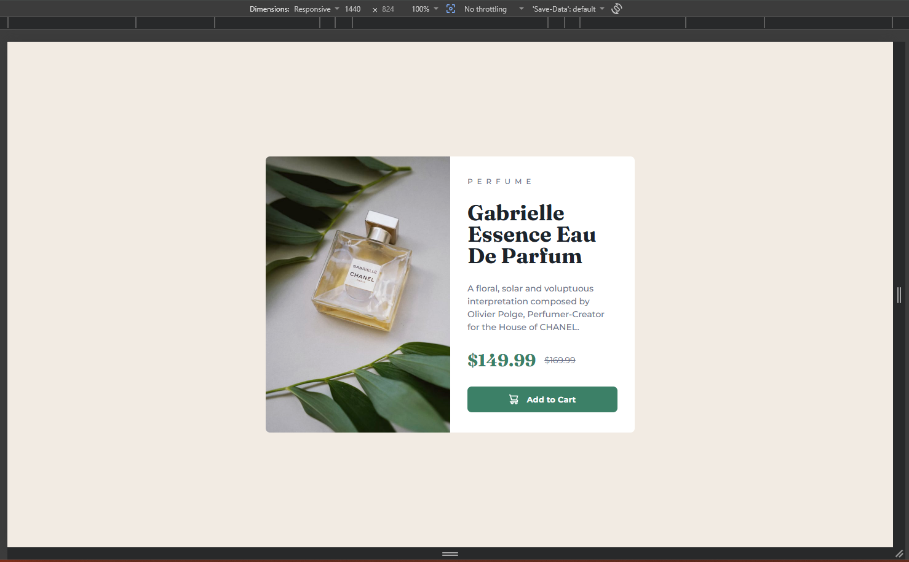
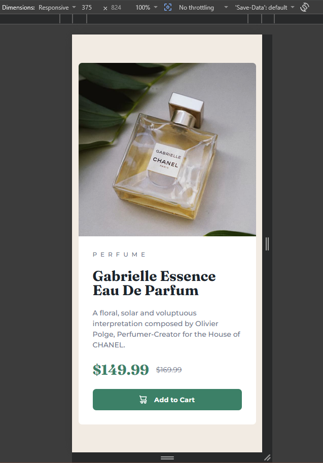

# Product preview card component

This is a solution to the [Product preview card component challenge on Frontend Mentor](https://www.frontendmentor.io/challenges/product-preview-card-component-GO7UmttRfa).

## Table of Contents

* [Overview](#overview)
* [Screenshot](#screenshot)
* [Links](#links)
* [Built With](#built-with)
* [What I Learned](#what-i-learned)
* [Continued Development](#continued-development)
* [Author](#author)

## Overview

A clean and modern product preview card component built with HTML and CSS. The design features a responsive layout with a product image that adapts to screen size, product details, pricing information, and an interactive call-to-action button.

### Screenshot

**Desktop View**

**Mobile View**

## Links

* [Live URL](https://vo1d-bot.github.io/Product-Preview-Card-Component/)
* Repository: [Github](https://github.com/vo1d-bot/Product-Preview-Card-Component)

## Built With

* **Semantic HTML5**
* **CSS3** (Flexbox, Custom properties, Media queries)
* **Mobile-first** responsive design
* `<picture>` element for responsive images
* Google Fonts (Montserrat, Fraunces)

## What I Learned

This project helped me strengthen my skills in:

* Using the `<picture>` element to serve different images based on screen size
* Structuring components with semantic HTML like `<article>`
* Building responsive layouts using Flexbox
* Managing design consistency using CSS custom properties
* Creating interactive UI elements with hover states
* Implementing clean typography using multiple font families

## Author

* GitHub - [vo1d-bot](https://github.com/vo1d-bot)
* Frontend Mentor - [vo1d-bot](https://www.frontendmentor.io/profile/vo1d-bot)

---

**Feedback & Suggestions Welcome!**
Feel free to leave any feedback or suggestions to help me improve.
